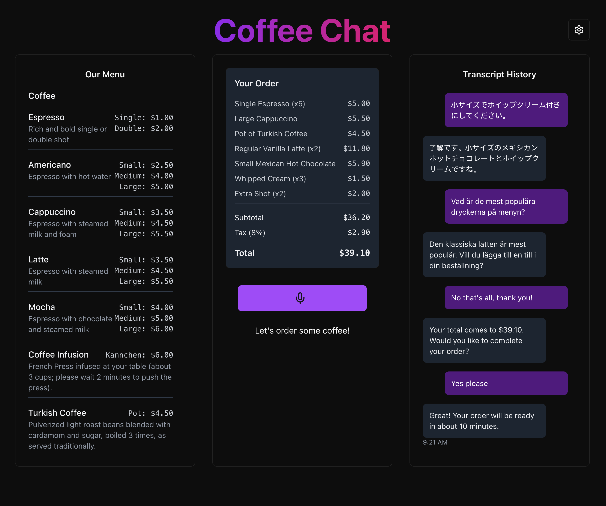
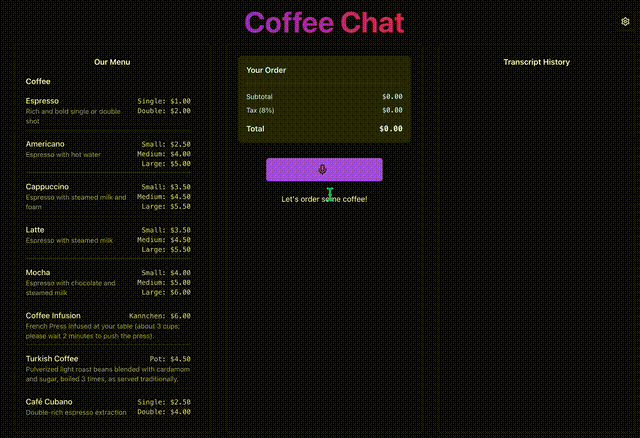
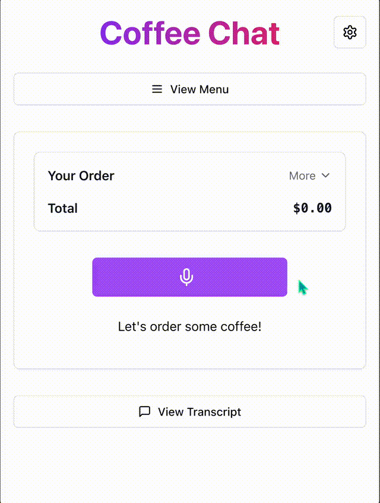
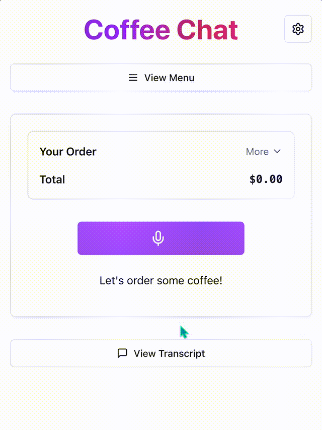

# Coffee Chat Voice Assistant

Coffee Chat Voice Assistant is an advanced, voice-driven ordering system leveraging Azure OpenAI GPT-4o Realtime API to recreate the authentic experience of ordering coffee from a friendly café barista. This system provides natural conversations to deliver engaging and intuitive responses, ensuring a seamless and enjoyable user experience. With real-time transcription, every spoken word is captured and displayed, ensuring clarity and accessibility.

As users place their orders, live updates are dynamically reflected on the screen, allowing them to see their selections build in real time. By simulating a true-to-life customer interaction, Coffee Chat Voice Assistant highlights the transformative potential of AI to enhance convenience and personalize the customer experience, creating a uniquely interactive and intuitive journey, adaptable for various industries and scenarios.

Beyond coffee enthusiasts, this technology can enhance accessibility and inclusivity, providing a hands-free, voice-driven experience for retail, hospitality, transportation, and more. Whether ordering on-the-go in a car, placing a contactless order from home, or supporting users with mobility challenges, this assistant demonstrates the limitless potential of AI-driven solutions for seamless user interactions.

## Table of Contents

- [Coffee Chat Voice Assistant](#coffee-chat-voice-assistant)
  - [Table of Contents](#table-of-contents)
  - [Acknowledgment](#acknowledgment)
  - [Visual Demonstrations](#visual-demonstrations)
    - [Desktop 4 Minute Interaction Big Order Demo](#desktop-4-minute-interaction-big-order-demo)
    - [Mobile Multilingual Ordering Demo](#mobile-multilingual-ordering-demo)
    - [UI Elements Walkthrough](#ui-elements-walkthrough)
  - [Features](#features)
    - [Architecture Diagram](#architecture-diagram)
  - [Getting Started](#getting-started)
    - [GitHub Codespaces](#github-codespaces)
    - [VS Code Dev Containers](#vs-code-dev-containers)
    - [Local environment](#local-environment)
  - [Ingesting Menu Items into Azure AI Search](#ingesting-menu-items-into-azure-ai-search)
    - [From JSON](#from-json)
      - [Steps:](#steps)
    - [From PDF](#from-pdf)
      - [Steps:](#steps-1)
  - [Running the App Locally](#running-the-app-locally)
    - [Option 1: Direct Local Execution (Recommended for Development)](#option-1-direct-local-execution-recommended-for-development)
    - [Option 2: Docker-based Local Execution](#option-2-docker-based-local-execution)
  - [Deploying to Azure](#deploying-to-azure)
  - [Contributing](#contributing)
  - [Resources](#resources)

## Acknowledgment

This project builds upon the [VoiceRAG Repository](https://github.com/Azure-Samples/aisearch-openai-rag-audio): an example of how to implement RAG support in applications that use voice as their user interface, powered by the GPT-4o realtime API for audio. The pattern is described in more detail in this [blog post](https://aka.ms/voicerag), and you can see this sample app in action in this [short video](https://youtu.be/vXJka8xZ9Ko). For the Voice RAG README, see [voice_rag_README.md](voice_rag_README.md)."

## Visual Demonstrations



### Desktop 4 Minute Interaction Big Order Demo  

This video showcases a 4-minute interaction where a user places a large order using the Coffee Chat Voice Assistant.  



[Watch the full video with audio](https://raw.githubusercontent.com/john-carroll-sw/coffee-chat-voice-assistant/main/docs/Demo/Desktop4MinuteInteractionBigOrder_smaller.mp4)  

---  

### Mobile Multilingual Ordering Demo  

This video demonstrates the multilingual ordering capabilities of the Coffee Chat Voice Assistant.  



[Watch the full video with audio](https://raw.githubusercontent.com/john-carroll-sw/coffee-chat-voice-assistant/main/docs/Demo/MultilingualOrdering_smaller.mp4)  

---  

### UI Elements Walkthrough  

This video provides a walkthrough of the various UI elements in the Coffee Chat Voice Assistant.  



[Watch the full video with audio](https://raw.githubusercontent.com/john-carroll-sw/coffee-chat-voice-assistant/main/docs/Demo/UIElementsWalkThrough_smaller.mp4)


## Features

- **Voice Interface**: Speak naturally to the app, and it processes your voice input in real-time using a flexible backend that supports various voice-to-text and processing services.
- **Retrieval-Augmented Generation (RAG)**: Leverages knowledge bases to ground responses in relevant and contextual information, such as menu-based ordering.
- **Real-Time Transcription**: Captures spoken input and provides clear, on-screen text transcriptions for transparency and accessibility.
- **Live Order Updates**: Dynamically displays order changes during the conversation by integrating advanced function-calling capabilities.
- **Audio Output**: Converts generated responses into human-like speech, with the app playing audio output through the browser's audio capabilities for seamless hands-free interactions.

### Architecture Diagram

The `RTClient` in the frontend receives the audio input, sends that to the Python backend which uses an `RTMiddleTier` object to interface with the Azure OpenAI real-time API, and includes a tool for searching Azure AI Search.


This repository includes infrastructure as code and a `Dockerfile` to deploy the app to Azure Container Apps, but it can also be run locally as long as Azure AI Search and Azure OpenAI services are configured.

## Getting Started

You have a few options for getting started with this template. The quickest way to get started is [GitHub Codespaces](#github-codespaces), since it will setup all the tools for you, but you can also [set it up locally](#local-environment). You can also use a [VS Code dev container](#vs-code-dev-containers)

### GitHub Codespaces

You can run this repo virtually by using GitHub Codespaces, which will open a web-based VS Code in your browser:

[](https://github.com/codespaces/new?hide_repo_select=true&ref=main&skip_quickstart=true&machine=basicLinux32gb&repo=860141324&devcontainer_path=.devcontainer%2Fdevcontainer.json&geo=WestUs2)

Once the codespace opens (this may take several minutes), open a new terminal and proceed to [deploy the app](#deploying-the-app).

### VS Code Dev Containers

You can run the project in your local VS Code Dev Container using the [Dev Containers extension](https://marketplace.visualstudio.com/items?itemName=ms-vscode-remote.remote-containers):

1. Start Docker Desktop (install it if not already installed)
2. Open the project:

    [](https://vscode.dev/redirect?url=vscode://ms-vscode-remote.remote-containers/cloneInVolume?url=https://github.com/john-carroll-sw/coffee-chat-voice-assistant)
3. In the VS Code window that opens, once the project files show up (this may take several minutes), open a new terminal, and proceed to [deploying the app](#deploying-the-app).

### Local environment

1. Install the required tools by running the prerequisites script:
   ```bash
   # Make the script executable
   chmod +x ./scripts/install_prerequisites.sh
   
   # Run the script
   ./scripts/install_prerequisites.sh
   ```

   The script will install:
   * Azure CLI tools
   * Log you into Azure
   * Check for Docker and prompt for installation if needed

   Alternatively, you can manually install:
   * [Azure Developer CLI](https://aka.ms/azure-dev/install)
   * [Node.js](https://nodejs.org/)
   * [Python >=3.11](https://www.python.org/downloads/)
   * [Git](https://git-scm.com/downloads)
   * [Docker Desktop](https://www.docker.com/products/docker-desktop)

2. Clone the repo (`git clone https://github.com/john-carroll-sw/coffee-chat-voice-assistant`)
3. Proceed to the next section to [deploy the app](#deploying-the-app).

## Ingesting Menu Items into Azure AI Search

### From JSON

If you have a JSON file containing the menu items for your café, you can use the provided Jupyter notebook to ingest the data into Azure AI Search.

#### Steps:

1. Open the `menu_ingestion_search_json.ipynb` notebook.
2. Follow the instructions to configure Azure OpenAI and Azure AI Search services.
3. Prepare the JSON data for ingestion.
4. Upload the prepared data to Azure AI Search.

This notebook demonstrates how to configure Azure OpenAI and Azure AI Search services, prepare the JSON data for ingestion, and upload the data to Azure AI Search for hybrid semantic search capabilities.

[Link to JSON Ingestion Notebook](scripts/menu_ingestion_search_json.ipynb)

### From PDF

If you have a PDF file of a café's menu that you would like to use, you can use the provided Jupyter notebook to extract text from the PDF, parse it into structured JSON format, and ingest the data into Azure AI Search.

#### Steps:

1. Open the `menu_ingestion_search_pdf.ipynb` notebook.
2. Follow the instructions to extract text from the PDF using OCR.
3. Parse the extracted text using GPT-4o into structured JSON format.
4. Configure Azure OpenAI and Azure AI Search services.
5. Prepare the parsed data for ingestion.
6. Upload the prepared data to Azure AI Search.

This notebook demonstrates how to extract text from a menu PDF using OCR, parse the extracted text into structured JSON format, configure Azure OpenAI and Azure AI Search services, prepare the parsed data for ingestion, and upload the data to Azure AI Search for hybrid semantic search capabilities.

[Link to PDF Ingestion Notebook](scripts/menu_ingestion_search_pdf.ipynb)

## Running the App Locally

You have two options for running the app locally for development and testing:

### Option 1: Direct Local Execution (Recommended for Development)

Run this app locally using the provided start scripts:

1. Create an `app/backend/.env` file with the necessary environment variables. You can use the provided sample file as a template:

   ```shell
   cp app/backend/.env-sample app/backend/.env
   ```

   Then, fill in the required values in the `app/backend/.env` file.

2. Run this command to start the app:

   Windows:

   ```pwsh
   pwsh .\scripts\start.ps1
   ```

   Linux/Mac:

   ```bash
   ./scripts/start.sh
   ```

3. The app will be available at [http://localhost:8000](http://localhost:8000)

### Option 2: Docker-based Local Execution

For testing in an isolated container environment:

1. Make sure you have an `.env` file in the `app/backend/` directory as described above.

2. Run the Docker build script:

   ```bash
   # Make the script executable
   chmod +x ./scripts/docker-build.sh
   
   # Run the build script
   ./scripts/docker-build.sh
   ```

   This script automatically handles:
   - Verifying/creating frontend environment variables
   - Building the Docker image with proper environment settings
   - Running the container with your backend configuration

3. Navigate to [http://localhost:8000](http://localhost:8000) to use the application.

Alternatively, you can manually build and run the Docker container:

```bash
# Build the Docker image
docker build -t coffee-chat-app \
  --build-arg VITE_AUTH_URL="https://your-auth-url.com" \
  --build-arg VITE_AUTH_ENABLED="true" \
  -f ./app/Dockerfile ./app

# Run the container with your environment variables
docker run -p 8000:8000 --env-file ./app/backend/.env coffee-chat-app:latest
```

## Deploying to Azure

To deploy the app to a production environment in Azure:

1. Make sure you have an `.env` file set up in the `app/backend/` directory. You can copy the sample file:

   ```bash
   cp app/backend/.env-sample app/backend/.env
   ```

2. Run the deployment script with minimal parameters:

   ```bash
   # Make the script executable
   chmod +x ./scripts/deploy.sh
   
   # Run the deployment with just the app name (uses all defaults)
   ./scripts/deploy.sh <name-of-your-app>
   ```

   The script will automatically:
   - Look for backend environment variables in `./app/backend/.env`
   - Look for or create frontend environment variables in `./app/frontend/.env`
   - Use the Dockerfile at `./app/Dockerfile`
   - Use the Docker context at `./app`
   
3. For more control, you can specify custom paths:

   ```bash
   ./scripts/deploy.sh \
     --env-file /path/to/custom/backend.env \
     --frontend-env-file /path/to/custom/frontend.env \
     --dockerfile /path/to/custom/Dockerfile \
     --context /path/to/custom/context \
     <name-of-your-app>
   ```

4. After deployment completes, your app will be available at the URL displayed in the console.

## Contributing

Contributions are welcome! Please open an issue or submit a pull request.

## Resources

- [OpenAI Realtime API Documentation](https://platform.openai.com/docs/guides/realtime)
- [Azure OpenAI Documentation](https://learn.microsoft.com/en-us/azure/ai-services/openai/)
- [Azure AI Services Documentation](https://learn.microsoft.com/en-us/azure/cognitive-services/)
- [Azure AI Search Documentation](https://learn.microsoft.com/en-us/azure/search/)
- [Azure AI Services Tutorials](https://learn.microsoft.com/en-us/training/paths/azure-ai-fundamentals/)
- [Azure AI Community Support](https://techcommunity.microsoft.com/t5/azure-ai/ct-p/AzureAI)
- [Azure AI GitHub Samples](https://github.com/Azure-Samples)
- [Azure AI Services API Reference](https://learn.microsoft.com/en-us/rest/api/cognitiveservices/)
- [Azure AI Services Pricing](https://azure.microsoft.com/en-us/pricing/details/cognitive-services/)
- [Azure Developer CLI Documentation](https://learn.microsoft.com/en-us/azure/developer/azure-developer-cli/)
- [Azure Developer CLI GitHub Repository](https://github.com/Azure/azure-dev)
